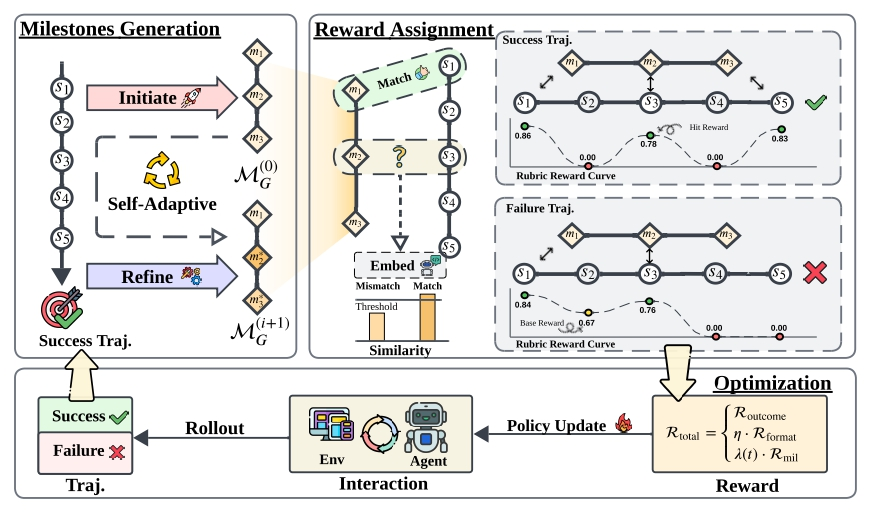

# ADMIRE

<h1 align="center">Adaptive Milestone Reward for GUI Agents</h1>

<p align="center">
  
</p>

<p align="center">
  中文 | <a href="README.md">English</a>
</p>

ADMIRE 是一个基于**自适应里程碑奖励**的强化学习框架，用于训练 GUI 自动化 Agent。该框架从成功轨迹中自动生成任务里程碑，并提供密集的过程奖励来指导 Agent 学习。

## 安装

### 环境要求

- Python 3.11
- PyTorch 2.2.0
- CUDA 12.6
- 8× GPU（推荐）

### 安装步骤

```bash
# 创建 conda 环境
conda create -n admire python=3.11 -y
conda activate admire

# 安装 PyTorch
pip install torch==2.2.0 torchvision==0.17.0 torchaudio==2.2.0 --index-url https://download.pytorch.org/whl/cu126

# 克隆项目
git clone https://github.com/your-repo/ADMIRE.git
cd ADMIRE

# 安装 verl
mkdir 3rdparty && git clone https://github.com/volcengine/verl 3rdparty/verl
cd 3rdparty/verl && pip install -e . && cd ../..

# 安装 android_world
git clone https://github.com/google-research/android_world 3rdparty/android_world
cd 3rdparty/android_world && pip install -e . && cd ../..

# 安装 ADMIRE
pip install -e .

# 安装其他依赖
pip install swanlab scikit-image spacy ray
python -m spacy download en_core_web_sm

# (可选) 登录 SwanLab 用于实验跟踪
swanlab login -k "your-api-key"
```

### Android 环境配置

参考 [AndroidWorld 配置指南](3rdparty/android_world/README.md) 配置 Android 模拟器。

## 快速开始

### 1. 启动 Ray 集群

```bash
ray stop
ray start --head --port=6379 --dashboard-port=8265
```

### 2. 启动环境服务器

```bash
python src/hammer_server/gradio_web_server.py \
    --num-devices 8 \
    --max-devices 8 \
    --crashed-device-restart \
    --concurrency-limit 8
```

### 3. 运行训练

```bash
bash run_hrpo_stepwise.sh
```

或使用自定义配置：

```bash
export HYDRA_FULL_ERROR=1
python -m hammer_trainer_stepwise.main_ppo \
    --config-path=./scripts \
    --config-name=config_stepwise_32.yaml \
    actor_rollout_ref.model.path="Qwen/Qwen2.5-VL-7B-Instruct" \
    trainer.total_epochs=20 \
    trainer.n_gpus_per_node=8
```

## 项目结构

```
ADMIRE/
├── src/
│   ├── hammer_agent/              # Agent 实现
│   ├── hammer_server/             # 环境服务器 (Gradio)
│   ├── hammer_trainer/            # 基础训练器
│   └── hammer_trainer_stepwise/   # 步级 RL 训练器（含里程碑奖励）
├── scripts/                       # 训练配置
│   ├── config_stepwise_32.yaml    # 默认步级训练配置
│   └── config_grpo.yaml           # GRPO 配置
├── 3rdparty/
│   ├── verl/                      # RL 训练框架
│   └── android_world/             # Android 环境
└── notebooks/
    └── visualize_step.ipynb       # 轨迹可视化
```

## 配置说明

`scripts/config_stepwise_32.yaml` 中的关键参数：

```yaml
# 环境配置
env:
  src: [" "] 
  max_envs: [16]
  max_steps: 30

# 模型配置
actor_rollout_ref:
  model:
    path: "Qwen/Qwen2.5-VL-7B-Instruct"
  rollout:
    n: 8                           # 每个 prompt 的 rollout 数量

# 训练配置
trainer:
  total_epochs: 20
  n_gpus_per_node: 8

# 里程碑奖励
milestone_reward:
  enable: true
  threshold: 0.75                  # 匹配的相似度阈值
  weight: 0.3

process_reward:
  enable: true
  weight: 1.0
  decay_gamma: 0.99
```

## 奖励机制

总奖励计算公式：

$$\mathcal{R}_{total} = \mathcal{R}_{outcome} + \eta \cdot \mathcal{R}_{format} + \lambda(t) \cdot \mathcal{R}_{mil}$$

配置方式：

```yaml
milestone_reward:
  enable: true
  weight: 0.3
  strategy: "mix"

process_reward:
  enable: true
  weight: 1.0
```

## 许可证

Apache License 2.0，详见 [LICENSE](LICENSE)。

## 致谢

- [verl](https://github.com/volcengine/verl) - ByteDance Seed Team
- [AndroidWorld](https://github.com/google-research/android_world) - Google Research
- [Qwen2.5-VL](https://github.com/QwenLM/Qwen2.5-VL) - Alibaba
